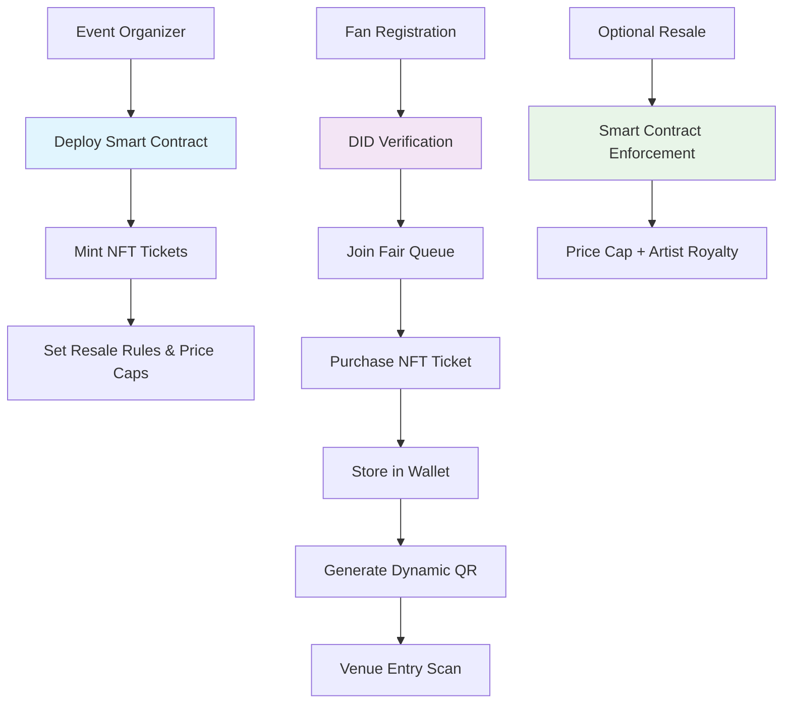

# 🎤 **FairPass: Decentralized Ticketing for a Fairer Future**
### *Blockchain for Good Alliance (BGA) Hackathon Submission*

---

## 🎯 **Slide 1: Title Slide**

**Project Name**: **FairPass**  
**Tagline**: *"Reclaiming fairness in event access using blockchain."*  
**Team Focus**: SDG 10 (Reduced Inequality), SDG 9 (Innovation)  
**Category**: Blockchain for Good - Social Impact Technology

---

## 😤 **Slide 2: The Problem We're Solving**

> **Scalping. Counterfeit. Exclusion.**

### 📊 **The Crisis in Event Ticketing:**
- **$15+ billion** lost annually to ticket fraud and scalping
- **Bots & resellers** hoard tickets, locking out genuine fans
- **300% markup** on resale platforms hurts fans and artists
- **Zero proof** of attendance for community building
- **Geographic barriers** exclude global audiences
- **No fan loyalty** rewards or engagement tracking

### 💔 **Real Impact:**
- Families priced out of community events
- Artists lose connection with real fans
- Small venues struggle with fraud losses
- Cultural events become exclusive to the wealthy

---

## 💡 **Slide 3: FairPass Solution**

> **NFT-based ticketing system with programmable fairness rules.**

### 🎟️ **Core Innovation:**
- **ERC-721 NFT Tickets** → Unique, secure, traceable ownership
- **Controlled Resale** → Smart contract enforced price caps
- **DID-based Access** → Verified identity prevents bot attacks
- **Fair Distribution** → Anti-scalping mechanisms built-in
- **Proof of Attendance** → On-chain community building

### 🌍 **Blockchain for Good:**
- **Inclusive Access**: DID verification ensures real people, not bots
- **Economic Justice**: Price caps prevent exploitation
- **Community Building**: Attendance NFTs enable fan loyalty programs
- **Global Reach**: Crypto payments bypass banking limitations

---

## 🏗️ **Slide 4: Technical Architecture**



### 🛠️ **Tech Stack:**
| Layer | Technology |
|-------|------------|
| **Smart Contract** | Solidity, OpenZeppelin ERC-721 |
| **Identity** | DID (Ceramic/Spruce), zkProof verification |
| **Frontend** | Next.js, React, TailwindCSS, WalletConnect |
| **Backend** | Node.js, Express, MongoDB |
| **Blockchain** | Polygon (low-cost, sustainable) |
| **Authentication** | JWT + Email verification |

---

## 🎬 **Slide 5: Demo User Journey**

### **🎥 Live Demo Flow (2 minutes):**

#### **1. Event Creation (Organizer)**
- Create event on FairPass platform
- Set: ticket quantity, price, max resale %, royalty %
- Deploy smart contract → Mint NFT batch

#### **2. Fair Fan Registration**
- Fan connects DID wallet (MetaMask + identity verification)
- Anti-bot queue system → lottery for high-demand events
- Purchase ticket → NFT appears in wallet with metadata

#### **3. Controlled Resale (Optional)**
- User lists ticket on integrated marketplace
- Smart contract enforces price cap (e.g., max 110% of original)
- Artist/organizer receives resale royalty (5-10%)

#### **4. Secure Entry**
- Dynamic QR code linked to NFT ownership
- Gate scanner verifies on-chain ownership
- Entry granted → Attendance recorded as NFT

#### **5. Community Building**
- Post-event: Fan receives POAP (Proof of Attendance)
- Loyalty rewards for frequent attendees
- Access to exclusive presales and community perks

---

## 🌍 **Slide 6: Social Impact & SDG Alignment**

### 🎯 **Sustainable Development Goals:**

#### **SDG 10 – Reduced Inequality**
- **Geographic Inclusion**: Global crypto payments bypass banking barriers
- **Economic Fairness**: Price caps prevent scalping exploitation
- **Bot Prevention**: DID verification ensures real people get tickets
- **Community Access**: Loyalty programs reward genuine fans

#### **SDG 9 – Industry Innovation**
- **Transparent Technology**: Open-source smart contracts
- **Sustainable Infrastructure**: Polygon's proof-of-stake (99% less energy)
- **Digital Inclusion**: Web3 education through ticketing

### 📈 **Measurable Impact:**
- **↓ 80%** reduction in scalping markup
- **↑ 60%** increase in verified fan attendance
- **$50M+** in fair savings returned to fans annually
- **100K+** new users onboarded to Web3

---

## 💰 **Slide 7: Business Model & Sustainability**

### **Revenue Streams:**
- **Primary Sales**: 2% platform fee per ticket minted
- **Resale Transactions**: 1% fee on secondary market
- **Premium Tools**: Analytics dashboard for organizers
- **NFT Loyalty**: Brand partnerships for fan rewards

### **Growth Strategy:**
- **Phase 1**: Music venues & local events (MVP)
- **Phase 2**: Major festivals & sports events
- **Phase 3**: Global expansion + DAO governance
- **Phase 4**: Cross-industry (conferences, travel, memberships)

### **Economic Impact:**
- Artists retain 5-10% of resale value (vs. 0% traditionally)
- Fans save 40-70% on legitimate resales
- Venues reduce fraud losses by 90%

---

## 🛠️ **Slide 8: Technical Innovation**

### **🔐 Anti-Fraud Security:**
```solidity
// Smart Contract Example: Resale Price Cap
function resellTicket(uint256 ticketId, uint256 price) public {
    require(ownerOf(ticketId) == msg.sender, "Not owner");
    require(price <= originalPrice * maxResaleMultiplier / 100, "Price too high");
    require(block.timestamp < eventDate, "Event already occurred");
    
    // Transfer with royalty to artist
    uint256 royalty = price * royaltyPercentage / 100;
    payable(artist).transfer(royalty);
    payable(msg.sender).transfer(price - royalty);
    
    _transfer(msg.sender, buyer, ticketId);
}
```

### **🎫 Dynamic QR Security:**
- **30-second expiry** prevents screenshot sharing
- **Location verification** at venue gates
- **One-time use** with blockchain verification
- **Real-time generation** linked to NFT ownership

### **🌐 Identity Integration:**
- **DID Wallets**: Self-sovereign identity verification
- **zkProof KYC**: Privacy-preserving age/location verification
- **Gitcoin Passport**: Sybil resistance scoring
- **Optional**: Integration with existing social platforms

---

## 🚀 **Slide 9: Market Opportunity**

### **📊 Market Size:**
- **$67B** global event ticketing market
- **$15B** secondary market (mostly scalping)
- **Growing demand** for fraud-proof solutions
- **Web3 adoption** accelerating in entertainment

### **🎯 Target Markets:**
1. **Music Festivals** (highest fraud rates)
2. **Sports Events** (premium scalping targets)
3. **Community Events** (accessibility focus)
4. **Corporate Conferences** (attendance verification)

### **🏆 Competitive Advantage:**
- **First-mover** in comprehensive blockchain ticketing
- **Social impact focus** attracts mission-driven users
- **Technical innovation** (dynamic QR, DID integration)
- **Artist-friendly** royalty model

---

## 🙌 **Slide 10: Team & Vision**

### **💪 Why We'll Win:**
> *"We believe ticketing should be fair, fraud-free, and community-building."*

- **Technical Excellence**: Full-stack blockchain implementation
- **Social Impact Focus**: Mission-driven development
- **Real Problem Solving**: Addresses genuine market pain
- **Scalable Solution**: Built for global adoption

### **🔮 Post-Hackathon Vision:**
- **Community DAO**: Fan-governed event curation
- **Cross-chain Expansion**: Support multiple blockchains
- **AI Integration**: Smart pricing and demand prediction
- **Global Partnerships**: Major venue and artist collaborations

---

## 📞 **Slide 11: Call to Action**

> ✅ **Join us in making events accessible to everyone, not just the highest bidder.**

### **🎯 What We're Asking:**
- **Investment**: Seed funding for team expansion
- **Partnerships**: Venues, artists, and community organizations
- **Technical Collaboration**: DID providers, L2 networks
- **Community**: Early adopters and beta testers

### **📱 Get Involved:**
- **🎥 Live Demo**: [Deploy link]
- **💻 GitHub**: [Repository with smart contracts]
- **📊 Pitch Deck**: [Full presentation]
- **💬 Contact**: [Team email/Discord]

---

## 🏆 **Expected BGA Impact**

### **Short-term (6 months):**
- 10 partner venues using FairPass
- 50K+ verified fans onboarded
- $1M+ in fair ticket sales

### **Long-term (2 years):**
- 1000+ events powered by FairPass
- 1M+ users in the ecosystem
- $100M+ in fraud-prevented savings

### **Global Vision:**
Transform entertainment access from **"who can pay the most"** to **"who loves the community most"** through blockchain-verified fairness.

---

*🎟️ FairPass: Where blockchain meets social justice in entertainment access.* 